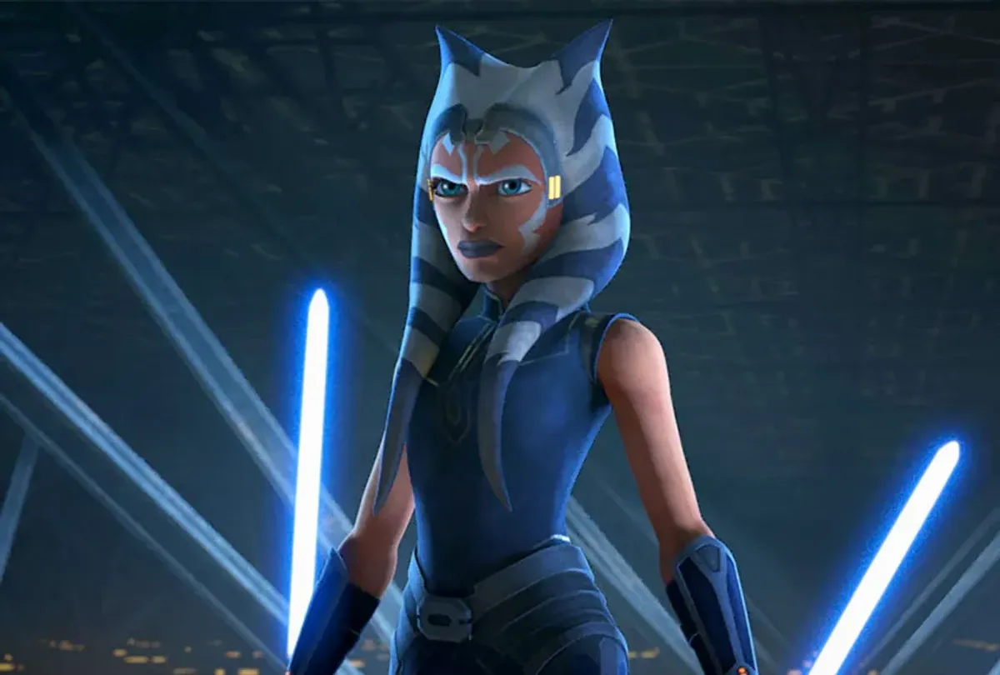

# CPE-322

## Hello
**I am Seongjun, 3/4 Computer Engineering major at Stevens Institute of Technology**

### Things I like
- Video Games
- Cooking
- Star Wars
- Animals

My favorite motto:
> Order, Peace, and Justice

Languages I speak
1. Korean
2. English

Favorite Codes:
` cout << "hello world" << endl; `
This code may be the most basic in C++, but it is the most important step every learner must go through.

---
A wise professor once told me:
*If you can finish something in 2 minutes, do it right away*

[Github](https://github.com/successjun/CPE-322/tree/main)

